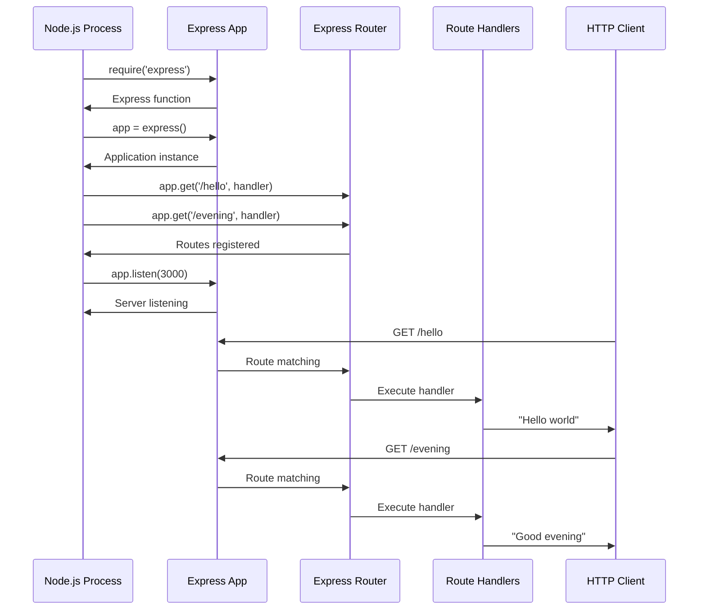
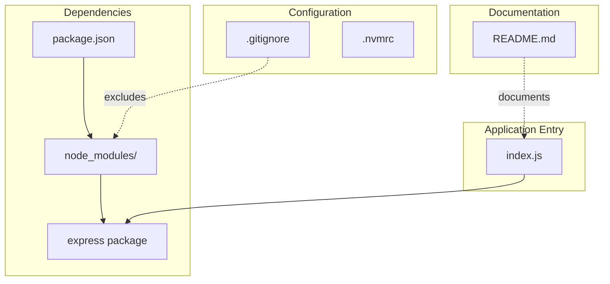
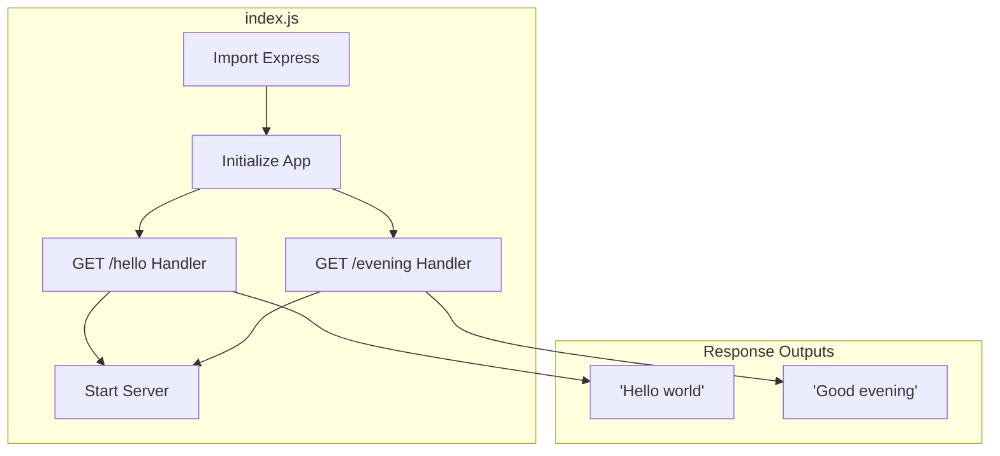

# Technical Specification

# 0. Agent Action Plan

## 0.1 Intent Clarification

This section captures and clarifies the user's feature requirements, transforming them into precise technical objectives for the Blitzy platform.

### 0.1.1 Core Feature Objective

Based on the prompt, the Blitzy platform understands that the new feature requirement is to:

- **Integrate Express.js Framework**: Add the Express.js web framework to the existing Node.js tutorial project, replacing or complementing the native HTTP module approach
- **Add "Good Evening" Endpoint**: Create a new HTTP endpoint that responds with the text "Good evening" when accessed
- **Preserve Existing "Hello World" Functionality**: Maintain the original endpoint that returns "Hello world" while introducing the new greeting endpoint

**Implicit Requirements Detected:**

| Implicit Requirement | Rationale |
|---------------------|-----------|
| Create `package.json` | Required for npm dependency management (Express.js installation) |
| Create `index.js` entry point | No server file currently exists in the repository |
| Implement Express application structure | Express requires app initialization with `express()` |
| Configure port binding | Server must listen on a configurable port (default: 3000) |
| Establish routing pattern | Multiple endpoints require Express router configuration |

**Feature Dependencies and Prerequisites:**

| Dependency | Type | Status |
|------------|------|--------|
| Node.js Runtime | System | Available (v24.12.0 installed) |
| npm Package Manager | System | Available (v11.6.2 installed) |
| Express.js Package | External | Required (to be installed) |
| Network Port Access | Infrastructure | Required (port 3000) |

### 0.1.2 Special Instructions and Constraints

**User-Specified Directives:**

User Example: *"this is a tutorial of node js server hosting one endpoint that returns the response 'Hello world'. Could you add expressjs into the project and add another endpoint that return the reponse of 'Good evening'?"*

**Architectural Requirements:**

- Follow Express.js best practices for route definition
- Maintain the educational/tutorial nature of the project
- Keep implementation minimal and easy to understand
- Ensure backward compatibility by preserving the "Hello world" response

**Web Search Requirements:**

| Research Topic | Finding |
|---------------|---------|
| Express.js Latest Version | v5.2.1 is the current stable release on npm |
| Node.js Compatibility | Express 5.x requires Node.js v18 or higher |
| Express 5 Features | Native async/await support, improved error handling |

### 0.1.3 Technical Interpretation

These feature requirements translate to the following technical implementation strategy:

| Requirement | Technical Action | Components |
|-------------|------------------|------------|
| Add Express.js | Install `express@5.2.1` as a production dependency | `package.json`, `node_modules/` |
| "Hello world" endpoint | Implement `GET /hello` route returning plain text "Hello world" | `index.js` |
| "Good evening" endpoint | Implement `GET /evening` route returning plain text "Good evening" | `index.js` |
| Server configuration | Create Express app instance with `app.listen(3000)` | `index.js` |

**Implementation Approach Summary:**

- To **integrate Express.js**, we will **create** a `package.json` with Express as a dependency and **create** an `index.js` that initializes an Express application
- To **implement the Hello World endpoint**, we will **create** a `GET /hello` route handler that sends "Hello world" as plain text response
- To **implement the Good Evening endpoint**, we will **create** a `GET /evening` route handler that sends "Good evening" as plain text response
- To **enable server operation**, we will **configure** the Express app to listen on port 3000 with appropriate startup logging

## 0.2 Repository Scope Discovery

This section documents the comprehensive file analysis of the existing repository and identifies all files that need to be created or modified.

### 0.2.1 Comprehensive File Analysis

**Current Repository State:**

The repository analysis reveals a minimal project structure requiring full implementation:

| Path | Type | Status | Purpose |
|------|------|--------|---------|
| `README.md` | File | EXISTS | Project documentation (contains only title "# jan6_1") |
| `.git/` | Directory | EXISTS | Git version control |

**Files Requiring Modification:**

| File Pattern | Action | Purpose |
|--------------|--------|---------|
| `README.md` | MODIFY | Add project description, setup instructions, and API documentation |

**Integration Point Discovery:**

Since this is essentially a greenfield implementation with only a README present, the integration points are:

| Integration Point | Location | Description |
|-------------------|----------|-------------|
| Package Configuration | `package.json` (new) | npm scripts and dependency declarations |
| Application Entry | `index.js` (new) | Main server file with Express routes |
| HTTP Clients | Any standard client | Compatible with browsers, curl, Postman |

### 0.2.2 New File Requirements

**New Source Files to Create:**

| File Path | Purpose | Description |
|-----------|---------|-------------|
| `index.js` | Application entry point | Express server initialization, route definitions, and port binding |
| `package.json` | Project manifest | Project metadata, dependencies, and npm scripts |

**New Test Files (Optional but Recommended):**

| File Path | Purpose | Description |
|-----------|---------|-------------|
| `tests/server.test.js` | Unit test coverage | Tests for both `/hello` and `/evening` endpoints |

**New Configuration Files:**

| File Path | Purpose | Description |
|-----------|---------|-------------|
| `.gitignore` | Git exclusions | Exclude `node_modules/` and other generated files |
| `.nvmrc` | Node version | Specify Node.js version for development consistency |

### 0.2.3 Web Search Research Conducted

| Research Area | Best Practice Finding |
|--------------|----------------------|
| Express.js endpoint implementation | Use `app.get()` method for GET routes with descriptive paths |
| Response handling | Use `res.send()` for plain text responses, automatically sets Content-Type |
| Server startup pattern | Use callback in `app.listen()` to log server readiness |
| Project structure | Single-file structure appropriate for tutorial/minimal applications |

### 0.2.4 Complete File Inventory

**Files to CREATE:**

```
jan6_1/
├── index.js              # Express server with two endpoints
├── package.json          # npm project manifest
├── .gitignore            # Git exclusion patterns
├── .nvmrc                # Node.js version specification
└── tests/
    └── server.test.js    # API endpoint tests (optional)
```

**Files to MODIFY:**

```
jan6_1/
└── README.md             # Update with project documentation
```

**Directories to CREATE:**

| Directory | Purpose |
|-----------|---------|
| `node_modules/` | npm dependencies (auto-generated by `npm install`) |
| `tests/` | Test file directory (optional) |

### 0.2.5 Directory Structure After Implementation

```
jan6_1/
├── .git/                 # Existing - unchanged
├── .gitignore            # NEW - exclude node_modules
├── .nvmrc                # NEW - specify Node.js 24.x
├── index.js              # NEW - Express server application
├── node_modules/         # AUTO-GENERATED - npm dependencies
│   └── express/          # Express.js and its dependencies
├── package.json          # NEW - project manifest
├── package-lock.json     # AUTO-GENERATED - dependency lock file
├── README.md             # MODIFIED - expanded documentation
└── tests/                # NEW - optional test directory
    └── server.test.js    # NEW - optional endpoint tests
```

## 0.3 Dependency Inventory

This section documents all dependencies required for the feature implementation, including both runtime and development dependencies.

### 0.3.1 Private and Public Packages

**Production Dependencies:**

| Registry | Package Name | Version | Purpose |
|----------|--------------|---------|---------|
| npm | `express` | `^5.2.1` | Web framework for HTTP server and routing |

**Express.js Transitive Dependencies (Auto-Installed):**

Express.js 5.x includes the following key dependencies that will be automatically installed:

| Package | Purpose |
|---------|---------|
| `body-parser` | Request body parsing middleware |
| `content-disposition` | Content-Disposition header utilities |
| `content-type` | Content-Type header parsing |
| `cookie` | Cookie parsing utilities |
| `debug` | Debugging utility |
| `depd` | Deprecation utilities |
| `encodeurl` | URL encoding |
| `etag` | ETag generation |
| `finalhandler` | Final HTTP responder |
| `fresh` | HTTP response freshness |
| `merge-descriptors` | Merge object descriptors |
| `methods` | HTTP methods list |
| `mime-types` | MIME type utilities |
| `on-finished` | Response finish detection |
| `parseurl` | URL parsing with caching |
| `path-to-regexp` | Path pattern matching |
| `proxy-addr` | Proxy address utilities |
| `qs` | Query string parsing |
| `range-parser` | HTTP Range header parsing |
| `raw-body` | Raw request body reading |
| `router` | Express router |
| `send` | Static file serving |
| `serve-static` | Static file middleware |
| `statuses` | HTTP status codes |
| `type-is` | Content-Type checking |
| `utils-merge` | Object merging |
| `vary` | Vary header manipulation |

**Development Dependencies (Optional):**

| Registry | Package Name | Version | Purpose |
|----------|--------------|---------|---------|
| npm | `jest` | `^29.7.0` | Testing framework (optional) |
| npm | `supertest` | `^7.0.0` | HTTP assertion library (optional) |

### 0.3.2 Runtime Environment Requirements

| Requirement | Version | Source |
|-------------|---------|--------|
| Node.js | 24.x LTS (Krypton) | Tech spec section 3.3 |
| npm | 11.x | Bundled with Node.js 24.x |

### 0.3.3 Dependency Updates

**Import Updates:**

Since this is a new implementation, no existing imports need updating. The following imports will be introduced:

| File | Import Statement | Purpose |
|------|------------------|---------|
| `index.js` | `const express = require('express');` | Import Express.js framework |

**Module System:**

The project will use CommonJS module syntax (`require`/`module.exports`) for maximum compatibility with the tutorial nature of the project.

### 0.3.4 Package.json Configuration

The following `package.json` structure will be created:

```json
{
  "name": "jan6_1",
  "version": "1.0.0",
  "description": "Node.js Express tutorial server",
  "main": "index.js",
  "scripts": {
    "start": "node index.js",
    "test": "echo \"No tests configured\" && exit 0"
  },
  "dependencies": {
    "express": "^5.2.1"
  },
  "engines": {
    "node": ">=18.0.0"
  }
}
```

### 0.3.5 Dependency Version Justification

| Package | Version Choice | Rationale |
|---------|---------------|-----------|
| `express` | `^5.2.1` | Latest stable version with native async/await support, improved security, and modern Node.js compatibility |

**Express 5.x Benefits for This Project:**

- Dropped support for legacy Node.js versions (requires Node.js 18+)
- Native promise/async support in middleware
- Improved security with updated `path-to-regexp` (ReDoS mitigation)
- Automatic rejected promise handling in route handlers
- Cleaner, more maintainable codebase

## 0.4 Integration Analysis

This section documents all integration touchpoints and how the new Express.js implementation connects with the existing project and external systems.

### 0.4.1 Existing Code Touchpoints

**Direct Modifications Required:**

| File | Modification | Location |
|------|--------------|----------|
| `README.md` | Add comprehensive project documentation | Lines 1-50 (replace existing single line) |

Since the repository currently contains only a README.md with a single heading, all other files will be newly created rather than modified.

### 0.4.2 Framework Integration Points

**Express Application Lifecycle:**



### 0.4.3 API Endpoint Integration

**Endpoint Configuration:**

| HTTP Method | Path | Response | Content-Type | Status Code |
|-------------|------|----------|--------------|-------------|
| GET | `/hello` | "Hello world" | text/plain | 200 |
| GET | `/evening` | "Good evening" | text/plain | 200 |
| ANY | `*` (unmatched) | Express default 404 | text/html | 404 |

**HTTP Client Compatibility:**

The Express endpoints will be accessible via:

| Client Type | Example Command |
|-------------|-----------------|
| curl | `curl http://localhost:3000/hello` |
| Browser | Navigate to `http://localhost:3000/hello` |
| Postman | GET request to `http://localhost:3000/evening` |
| fetch API | `fetch('http://localhost:3000/hello')` |

### 0.4.4 Environment Integration

**Port Configuration:**

| Variable | Default | Source |
|----------|---------|--------|
| `PORT` | `3000` | Environment variable or hardcoded default |

**Server Binding:**

The Express server will bind to:
- Host: `0.0.0.0` (all network interfaces) or `localhost` (local only)
- Port: `3000` (configurable via environment)

### 0.4.5 Project Structure Integration

**File Dependency Graph:**



### 0.4.6 Database/Schema Updates

**Not Applicable** - This feature does not require database integration. The application is stateless and serves only static text responses.

### 0.4.7 Middleware Integration

For this minimal tutorial implementation, no custom middleware is required. Express provides built-in handling for:

| Functionality | Express Built-in |
|---------------|------------------|
| Request parsing | Automatic URL parsing |
| Response handling | `res.send()` method |
| Route matching | Express Router |
| 404 handling | Default finalhandler |

### 0.4.8 External Service Integration

**Not Applicable** - This tutorial project does not integrate with external services. All functionality is self-contained within the Express server.

## 0.5 Technical Implementation

This section provides a detailed file-by-file execution plan for implementing the Express.js feature addition.

### 0.5.1 File-by-File Execution Plan

**CRITICAL: Every file listed here MUST be created or modified.**

**Group 1 - Core Application Files:**

| Action | File Path | Implementation Details |
|--------|-----------|----------------------|
| CREATE | `index.js` | Express server with `/hello` and `/evening` route handlers |
| CREATE | `package.json` | Project manifest with Express.js dependency |

**Group 2 - Configuration Files:**

| Action | File Path | Implementation Details |
|--------|-----------|----------------------|
| CREATE | `.gitignore` | Exclude `node_modules/`, `*.log`, `.env` |
| CREATE | `.nvmrc` | Specify Node.js version `24` |

**Group 3 - Documentation:**

| Action | File Path | Implementation Details |
|--------|-----------|----------------------|
| MODIFY | `README.md` | Add project description, installation, usage, and API documentation |

**Group 4 - Tests (Optional):**

| Action | File Path | Implementation Details |
|--------|-----------|----------------------|
| CREATE | `tests/server.test.js` | Endpoint testing with Jest/Supertest |

### 0.5.2 Implementation Specifications

**File: `index.js`**

```javascript
const express = require('express');
const app = express();
const PORT = process.env.PORT || 3000;
```

Route Implementations:
- `GET /hello` - Returns "Hello world" as plain text
- `GET /evening` - Returns "Good evening" as plain text
- Server listens on port 3000 with startup confirmation log

**File: `package.json`**

Key configurations:
- `name`: "jan6_1"
- `version`: "1.0.0"
- `main`: "index.js"
- `scripts.start`: "node index.js"
- `dependencies.express`: "^5.2.1"
- `engines.node`: ">=18.0.0"

**File: `.gitignore`**

Exclusion patterns:
- `node_modules/`
- `*.log`
- `.env`
- `.DS_Store`

**File: `.nvmrc`**

Content: `24`

**File: `README.md`**

Sections to include:
- Project title and description
- Prerequisites
- Installation instructions
- Usage guide
- API endpoint documentation
- License information

### 0.5.3 Implementation Approach per File

**Phase 1: Establish Feature Foundation**

| Step | File | Action | Verification |
|------|------|--------|--------------|
| 1.1 | `package.json` | Create project manifest | `npm init` succeeds |
| 1.2 | `.nvmrc` | Specify Node.js version | File contains "24" |
| 1.3 | `.gitignore` | Create exclusion rules | File exists with patterns |

**Phase 2: Install Dependencies**

| Step | Command | Expected Result |
|------|---------|-----------------|
| 2.1 | `npm install express@^5.2.1` | Express installed to `node_modules/` |
| 2.2 | Verify installation | `package-lock.json` generated |

**Phase 3: Create Express Application**

| Step | File | Action | Verification |
|------|------|--------|--------------|
| 3.1 | `index.js` | Create Express app instance | No syntax errors |
| 3.2 | `index.js` | Define `/hello` route | Route registered |
| 3.3 | `index.js` | Define `/evening` route | Route registered |
| 3.4 | `index.js` | Configure server listen | Port binding works |

**Phase 4: Document and Validate**

| Step | File | Action | Verification |
|------|------|--------|--------------|
| 4.1 | `README.md` | Update documentation | Complete sections |
| 4.2 | Manual test | Start server and test endpoints | Both return correct responses |

### 0.5.4 Code Structure Overview



### 0.5.5 Testing Strategy

**Manual Testing Commands:**

| Test | Command | Expected Output |
|------|---------|-----------------|
| Start server | `npm start` | "Server running on port 3000" |
| Test /hello | `curl http://localhost:3000/hello` | "Hello world" |
| Test /evening | `curl http://localhost:3000/evening` | "Good evening" |
| Test 404 | `curl http://localhost:3000/invalid` | 404 response |

**Automated Testing (Optional):**

If implementing tests with Jest and Supertest:

```javascript
// tests/server.test.js structure
describe('API Endpoints', () => {
  test('GET /hello returns Hello world');
  test('GET /evening returns Good evening');
});
```

## 0.6 Scope Boundaries

This section defines the explicit boundaries of what is included and excluded from the feature implementation scope.

### 0.6.1 Exhaustively In Scope

**Source Files:**

| Pattern | Description |
|---------|-------------|
| `index.js` | Main Express server application file |
| `package.json` | npm project manifest |
| `package-lock.json` | Auto-generated dependency lock file |

**Configuration Files:**

| Pattern | Description |
|---------|-------------|
| `.gitignore` | Git exclusion patterns |
| `.nvmrc` | Node.js version specification |

**Documentation Files:**

| Pattern | Description |
|---------|-------------|
| `README.md` | Project documentation (modified) |

**Auto-Generated Directories:**

| Pattern | Description |
|---------|-------------|
| `node_modules/**/*` | npm dependencies (auto-generated) |

**Test Files (Optional):**

| Pattern | Description |
|---------|-------------|
| `tests/**/*.test.js` | API endpoint tests |

### 0.6.2 Integration Points In Scope

| Integration Point | File | Lines/Sections |
|-------------------|------|----------------|
| Express initialization | `index.js` | App creation with `express()` |
| Route registration | `index.js` | `app.get('/hello', ...)` and `app.get('/evening', ...)` |
| Server binding | `index.js` | `app.listen(3000, ...)` |
| Dependency declaration | `package.json` | `"express": "^5.2.1"` |
| npm scripts | `package.json` | `"start": "node index.js"` |

### 0.6.3 API Endpoints In Scope

| Method | Path | Response | In Scope |
|--------|------|----------|----------|
| GET | `/hello` | "Hello world" | ✅ Yes |
| GET | `/evening` | "Good evening" | ✅ Yes |
| ANY | `*` (404) | Default Express 404 | ✅ Yes (automatic) |

### 0.6.4 Explicitly Out of Scope

**Features Not Included:**

| Item | Reason |
|------|--------|
| Database integration | Not specified in requirements |
| User authentication | Not specified in requirements |
| Additional middleware | Tutorial simplicity |
| API versioning | Single-version implementation |
| HTTPS/TLS configuration | Development environment only |
| Environment variable configuration beyond PORT | Minimal requirements |
| Docker containerization | Not specified |
| CI/CD pipeline configuration | Not specified |
| Load balancing | Tutorial scope |
| Logging middleware | Tutorial simplicity |
| Request validation | Tutorial simplicity |
| Error handling middleware | Express defaults sufficient |
| Rate limiting | Not specified |
| CORS configuration | Not specified |
| API documentation (Swagger/OpenAPI) | Tutorial simplicity |

**Files Not Modified:**

| File | Reason |
|------|--------|
| `.git/**/*` | Git internals - never modified |

**Unrelated Features:**

| Feature | Reason for Exclusion |
|---------|---------------------|
| POST/PUT/DELETE endpoints | Only GET endpoints requested |
| Response caching | Not specified in requirements |
| Request body parsing | No POST data handling required |
| Query parameter handling | Not specified in requirements |
| Static file serving | Not specified in requirements |
| Template rendering | Plain text responses only |

### 0.6.5 Scope Diagram

```mermaid
flowchart TB
    subgraph InScope["✅ IN SCOPE"]
        direction TB
        Express["Express.js Integration"]
        Hello["GET /hello Endpoint"]
        Evening["GET /evening Endpoint"]
        Package["package.json"]
        Index["index.js"]
        GitIgnore[".gitignore"]
        NVMRC[".nvmrc"]
        README["README.md Update"]
    end
    
    subgraph OutScope["❌ OUT OF SCOPE"]
        direction TB
        Database["Database"]
        Auth["Authentication"]
        HTTPS["HTTPS/TLS"]
        Docker["Docker"]
        CICD["CI/CD"]
        Middleware["Custom Middleware"]
        Caching["Caching"]
        Logging["Advanced Logging"]
    end
```



### 0.6.6 Boundary Conditions

| Boundary | Specification |
|----------|---------------|
| Maximum response size | Plain text, < 100 bytes |
| Supported HTTP methods | GET only |
| Supported paths | `/hello`, `/evening` |
| Error responses | Express default 404/500 |
| Concurrent connections | Node.js default limits |
| Request timeout | Express/Node.js defaults |
| Content encoding | Plain text (UTF-8) |

## 0.7 Special Instructions

This section captures special requirements, constraints, and instructions specific to this feature addition.

### 0.7.1 Feature-Specific Requirements

**User-Emphasized Requirements:**

| Requirement | Priority | Notes |
|-------------|----------|-------|
| Add Express.js framework | Critical | Core framework for web server functionality |
| Return "Good evening" response | Critical | Exact text as specified by user |
| Preserve "Hello world" response | Critical | Maintain existing expected behavior |
| Tutorial nature | Important | Keep implementation simple and educational |

**Architectural Patterns to Follow:**

| Pattern | Application |
|---------|-------------|
| Single-file structure | All server code in `index.js` for tutorial clarity |
| Express route handlers | Use `app.get()` pattern for route definitions |
| Callback-style listen | Use `app.listen(port, callback)` for server startup |
| CommonJS modules | Use `require()` syntax for imports |

### 0.7.2 Integration Requirements with Existing Features

| Existing Behavior | Integration Approach |
|-------------------|---------------------|
| "Hello world" response | Implement as `/hello` endpoint with Express |
| Port 3000 binding | Maintain same port for consistency |
| Plain text responses | Use `res.send()` which auto-sets Content-Type |

### 0.7.3 Performance Considerations

| Consideration | Implementation |
|---------------|----------------|
| Startup time | Minimal dependencies, fast server start |
| Response latency | Simple handlers with no I/O operations |
| Memory footprint | Express minimal configuration |
| Concurrent handling | Node.js event loop handles concurrency |

### 0.7.4 Security Requirements

| Security Aspect | Implementation |
|-----------------|----------------|
| Input validation | Not required (no user input accepted) |
| Output encoding | Plain text, no HTML injection risk |
| Dependency security | Use latest Express 5.x with security patches |
| Path traversal | Not applicable (no file serving) |

### 0.7.5 Exact Response Specifications

**User Example Preservation:**

The user specified exact response text that must be preserved:

| Endpoint | Exact Response Text | Notes |
|----------|---------------------|-------|
| `/hello` | `Hello world` | Exact casing and spacing |
| `/evening` | `Good evening` | Exact casing and spacing |

### 0.7.6 Development Environment Setup

**Required Commands:**

| Step | Command | Purpose |
|------|---------|---------|
| 1 | `nvm use 24` or ensure Node.js 24.x | Set correct Node.js version |
| 2 | `npm install` | Install dependencies |
| 3 | `npm start` | Start the server |

**Verification Commands:**

| Test | Command | Expected Result |
|------|---------|-----------------|
| Server health | `curl -s http://localhost:3000/hello` | `Hello world` |
| New endpoint | `curl -s http://localhost:3000/evening` | `Good evening` |

### 0.7.7 Code Quality Standards

| Standard | Application |
|----------|-------------|
| Indentation | 2 spaces |
| Semicolons | Required |
| Quotes | Single quotes for strings |
| Variable declarations | `const` for constants, `let` for variables |
| Comments | Minimal, code should be self-documenting |

### 0.7.8 Deployment Readiness Checklist

| Item | Status | Notes |
|------|--------|-------|
| Dependencies locked | ✅ | `package-lock.json` generated |
| Start script defined | ✅ | `npm start` available |
| Port configurable | ✅ | `PORT` environment variable supported |
| Node.js version specified | ✅ | `.nvmrc` file and `engines` in package.json |
| Git exclusions configured | ✅ | `.gitignore` excludes node_modules |

### 0.7.9 Backward Compatibility

| Aspect | Guarantee |
|--------|-----------|
| "Hello world" response | Preserved via `/hello` endpoint |
| Port binding | Same port 3000 default |
| HTTP client compatibility | All standard HTTP clients supported |
| Response format | Plain text maintained |

### 0.7.10 Success Criteria

| Criterion | Validation Method |
|-----------|-------------------|
| Server starts without errors | `npm start` returns no errors |
| `/hello` returns "Hello world" | `curl http://localhost:3000/hello` outputs "Hello world" |
| `/evening` returns "Good evening" | `curl http://localhost:3000/evening` outputs "Good evening" |
| Express.js installed | `express` present in `node_modules/` |
| Documentation updated | `README.md` contains setup and usage instructions |

